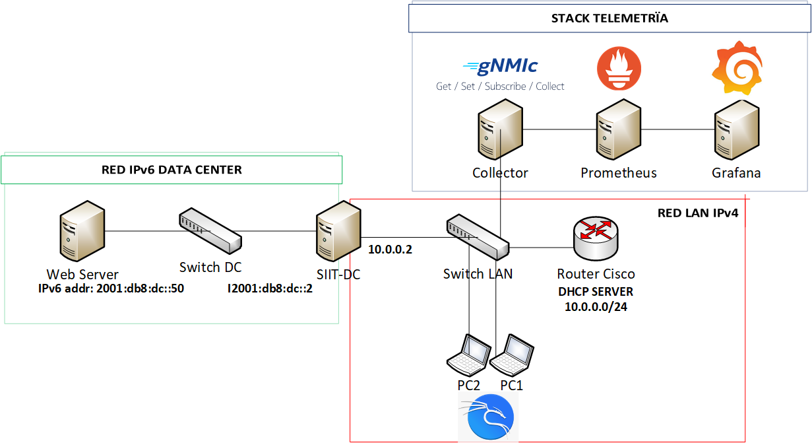

# Stack de Telemetría en un entorno SIIT-DC con Containerlab
  
## Descripción
La topología creada provee un laboratorio de pruebas para el análisis de seguridad mediante un Stack de Telemetría en un entorno de red IPv4/IPv6 basado en SIIT-DC 
### Topología creada


## Descripción Stack de Telemetría
Permite suscripción a métricas ACLs match packets, broadcast packets y consumo de CPU recibidas desde un dispositivo Nokia SRL vía gNMI. 
* Nodo colector gNMIc Openconfig, recibe y exporta a Stack Prometheus/Grafana  

``
## Deploy de la topología
```console
clab deploy -t tele-siitdc.yml
```
## Acceso a los nodos
#### Nodo gNMIc
```console
docker exec -it clab-telemetria-siitdc-gNMIc /bin/bash
```
suscripción a métricas, ejecutar: `gnmic subscribe --config /gnmic-config.yml`
#### Servidor web
```console
docker exec -it clab-telemetria-siitdc-webserver /bin/bash
```
Iniciar servidor ejecutando `nginx`
#### PCs Linux
```console
docker exec -it clab-telemetria-siitdc-PC2 /bin/bash
docker exec -it clab-telemetria-siitdc-PC3 /bin/bash
```
Eliminar ruta por defecto en eth0: `ip route del default dev eth0` y ejecutar cliente dhcp con `dhclient eth1`
Comprobar acceso al servidor web ejecutando solicitud HTTP: `wget http://192.168.0.80`
#### Acceso al Dashboard Grafana
* Desde navegador en host local a la url: `http://ip-hostlocal:3000`
## Ejemplos ataques
### Flooding tool. From https://www.kali.org/tools/t50/
>***Ataque de DoS hacia Servidor SIIT-DC por inundación de mensajes desde IPs origen randómicas** 
* Desde **PC2**
  *  Lanzar el ataque ejecutando: `t50 10.0.0.2 --flood`
  *  Ataque mitigado por ACL IPv4 block spoofing. Visualización en Dashboard Matched Packets por ACL Entry.
>***Ataque de inundación mediante envío de paquetes a dirección broadcast desde dirección IP válida** 
* Desde **PC3**
  *  Lanzar el ataque ejecutando: `t50 -s 10.0.0.4 10.0.0.255 --flood`
  *  No mitigable por ACL. Detectado por suscripción a métrica Multicast Packets por Interface y visualización en Grafana.    

## Author
MSc. Ernesto Sánchez. 
linkedin: https://www.linkedin.com/in/ernestosanchez73

## License
This project is licensed under the [MIT] License - see the LICENSE.txt file for details


