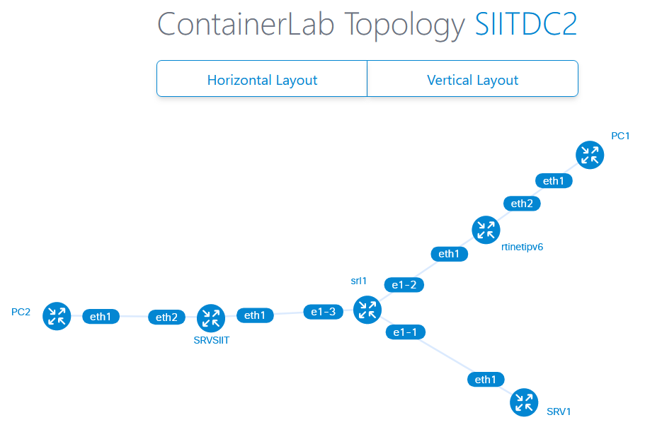

# SIIT-DC based in Containerlab
  Stateless IP/ICMP Translator 

## Descripción
La siguiente topología integra un servidor SIIT-DC Jool a Containerlab, que permitirá realizar pruebas basadas en IPv4/IPv6 Translation

## Requerimientos de software y SO

Para desplegar la topología propuesta debe disponer de:

* Dispositivo Host con Containerlab instalado:
* Sistema Operativo Linux "Ubuntu 22.04.3 LTS". Kernel headers 5.15.0-116-generic
* Docker Engine - Community Version: 24.0.7
* Containerlab version: 0.56.0

## Instalación de los archivos de topología

* Clonar la topología ejecutando: git clone https://github.com/ernestosv73/siitdc2.git

## Deploy de la topología

* Desde el directorio /siitdc2, ejecutar el comando: clab deploy -t siitdc.yml

## Acceso a los nodos

* Para acceder a CLI de cada nodo, ejecutar: 

* Nodo SRVSIIT:  docker exec -it clab-siitdc2-SRVSIIT /bin/bash
* Nodo SRV1:     docker exec -it clab-siitdc2-SRV1 /bin/bash
* Nodo PC1:      docker exec -it clab-siitdc2-PC1 /bin/bash
* Nodo PC2:      docker exec -it clab-siitdc2-PC2 /bin/bash

## Descripción del ejemplo de prueba 
### Topología creada

### Descripción de Contenedores
* Contenedor SRVSIIT: image docker Ubuntu 22.04. Jool version 4.2.0-rc2
* Contenedor SRV1: image docker Ubuntu 22.04
* Contenedor PC1 y PC2: image docker Alpine Linux
* El detalle las configuraciones de red se encuentran en el archivo .yml

### Descripción del ejemplo de prueba: Explicit Address Mappings Table - EAMT

## Author

MSc. Ernesto Sánchez. 

mail: esanchez@ucasal.edu.ar

linkedin: https://www.linkedin.com/in/ernestos%C3%A1nchez

## License

This project is licensed under the [MIT] License - see the LICENSE.txt file for details

## Acknowledgments

* Alejandro Acosta
* Henri Alvesde Godoy. henri.godoy@fca.unicamp.br
* Silvio Lucas da Silva. silvio.lucas@ifpb.edu.br 
